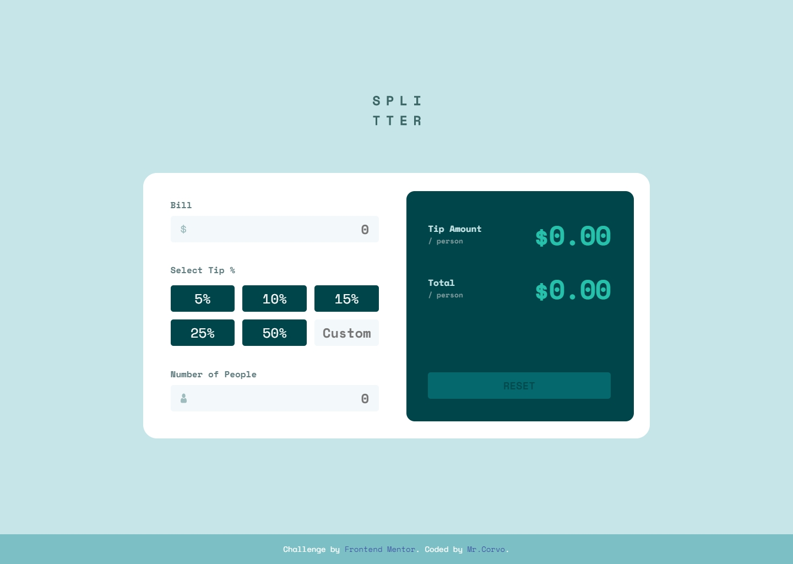

# Frontend Mentor - Tip calculator app solution

This is a solution to the [Tip calculator app challenge on Frontend Mentor](https://www.frontendmentor.io/challenges/tip-calculator-app-ugJNGbJUX). Frontend Mentor challenges help you improve your coding skills by building realistic projects.

## Table of contents

- [Overview](#overview)
  - [The challenge](#the-challenge)
  - [Screenshot](#screenshot)
  - [Links](#links)
- [My process](#my-process)
  - [Built with](#built-with)
  - [What I learned](#what-i-learned)
  - [Continued development](#continued-development)
  - [Useful resources](#useful-resources)
- [Author](#author)
- [Acknowledgments](#acknowledgments)


## Overview

### The challenge
Users should be able to:

- View the optimal layout for the app depending on their device's screen size
- See hover states for all interactive elements on the page
- Calculate the correct tip and total cost of the bill per person

### Screenshot Solution


### Links
- Solution URL: [https://mr-corvo.github.io/Tip-Calculator-App](https://mr-corvo.github.io/Tip-Calculator-App)

## My process

### Built with
- My template project
- Scss
- FlexBox
- CSS custom properties and dymamic properties

### What I learned
To remove controllers that appear in the input type="number"
```css
// Chrome and other browsers
input::-webkit-outer-spin-button,
input::-webkit-inner-spin-button {
   -webkit-appearance: none;
   margin: 0;
}
// Firefox
input[type="number"] {
   -moz-appearance: textfield;
}
input[type="number"]:hover,
input[type="number"]:focus {
   -moz-appearance: number-input;
}
```
To round the number. For example number 143.4997 to 143.49
```js
const formatter = new Intl.NumberFormat('en-US', {
   minimumFractionDigits: 2,      
   maximumFractionDigits: 2,
});      
console.log(formatter.format(143.4997)); // "143.49"
```

### Continued development
I did this project because I was interested to try. And in the future I want me to do my own projects with great pleasure. I also want and will find ways to accelerate and optimize the work process

## Author
At the time of 2021 I am 14 years old. Programming I began to get involved 3 years ago. And the active studied the frontend on the length of 1-2 years. In 2007, I was born in Kazakhstan, and only recently began to study England. My level of Anglicic is not so great to write everything higher, so I used Google by a translator (I hope you understood the essence of everything that I wrote above). I left the school in the 5th grade, and since then I am learning myself what I like. Almost every day I get up at 4 in the morning, and I am doing a favorite thing. I'm not sure that I am writing it for anyone, rather for myself in the future

- My Account on Freelance - [Mr.Corvo Weblancer.com](https://www.weblancer.net/users/MrCorvo/)
- Frontend Mentor - [@Mr-Corvo](https://www.frontendmentor.io/profile/Mr-Corvo)
- ProtonMail - Mr.Corvo@pm.me

Challenge by Frontend Mentor. Coded by Mr.Corvo.
